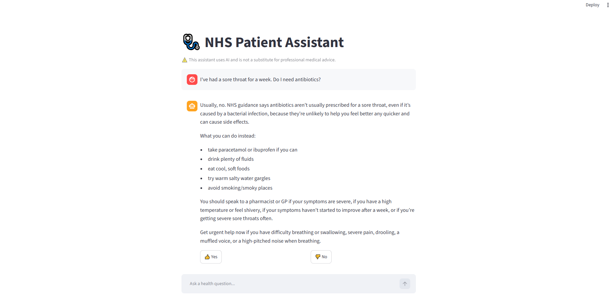
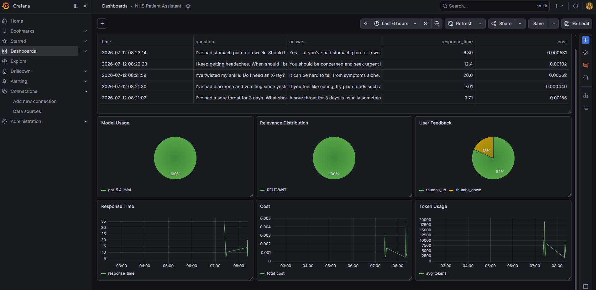

# NHS Patient Assistant

## Table of Contents 

- Problem Description
- Architecture
- Dataset
- Automated Ingestion Pipeline
- Retrieval Flow
- Retrieval Evaluation
- LLM Evaluation
- Interface
- Monitoring
- Project Structure
- Installation
- Running the Project
- API Examples
- Technologies
- Future Improvements

---

# Problem Description

Patients frequently search the internet for medical advice. Large language models can produce convincing but incorrect medical information if they rely only on their internal knowledge.

This project builds an end-to-end Retrieval-Augmented Generation (RAG) assistant grounded on the **NHS Inform Scotland** knowledge base. Instead of answering purely from model knowledge, responses are generated from relevant NHS documentation retrieved from a PostgreSQL knowledge base.

The application allows users to:

- Ask questions about illnesses and conditions
- Receive answers grounded in NHS Inform Scotland content
- Provide feedback on responses
- Monitor usage through Grafana dashboards

---

# Architecture

```text
                NHS Inform Scotland
                        │
                 nhs_download.py
                        │
              nhs-symptom.json (425)
                        │
             nhs_chunking_data.py
                        │
         nhs-symptom-chunks.json (6855)
                        │
                  ingest.py
                        │
       PostgreSQL + pgvector + FTS
                        │
                Hybrid Retrieval
        (Keyword + Vector + RRF)
                        │
               GPT-5.4-mini
                        │
                Streamlit UI
                        │
          Flask REST API (/question, /feedback)
                        │
          PostgreSQL Conversation Logs
                        │
                  Grafana Dashboard
```

---

# Dataset

Source:

https://www.nhsinform.scot/illnesses-and-conditions/a-to-z/

## Raw Dataset

- 425 NHS illness and condition pages
- Stored as [`data/nhs-symptom.json`](data/nhs-symptom.json)

Each record contains:

- ID
- category
- section
- URL
- Markdown content

## Chunked Dataset

- 6,855 chunks
- Stored as [`data/nhs-symptom-chunks.json`](data/nhs-symptom-chunks.json)

Each chunk contains:

- chunk ID
- parent ID
- category
- section
- parent document
- heading
- Markdown content
- URL

Heading-aware chunking improves retrieval quality while preserving document structure.

---

# Automated Ingestion Pipeline

The entire ingestion process is automated.

```text
make update-data
      │
      ├── download
      │     └── nhs_download.py
      │           ↓
      │    nhs-symptom.json
      │
      ├── chunk
      │     └── nhs_chunking_data.py
      │           ↓
      │    nhs-symptom-chunks.json
      │
      └── ingest
            └── ingest.py
                  ↓
        PostgreSQL Knowledge Base
```

Run:

```bash
make update-data
```

---

# Retrieval Flow

```text
User Question
      │
Hybrid Retrieval
 ├── Keyword Search/ Query Rewrite
 └── Vector Search
      │
Reciprocal Rank Fusion
      │
Top Documents
      │
GPT-5.4-mini
      │
Grounded Answer
```

The application combines:

- PostgreSQL Full Text Search
- pgvector semantic search
- Reciprocal Rank Fusion (RRF)
- Query rewriting

---

# Retrieval Evaluation

Ground truth generated from 100 NHS documents (2 questions per document).

| Method | Hit Rate | MRR |
|---------|---------:|----:|
| Keyword |0.800|0.596|
| Keyword + Query Rewrite|0.865|0.633|
| Vector|0.850|0.640|
| **Hybrid (Selected)**|**0.950**|**0.690**|

Hybrid retrieval produced the best overall performance and is used by the application.

---

# LLM Evaluation

LLM-as-a-Judge was used to compare multiple models.

| Model | Relevant | Partly Relevant |
|-------|----------:|----------------:|
| GPT-5.4-mini |98.0%|2.0%|
| GPT-4o|91.5%|8.5%|

GPT-5.4-mini was selected because it produced the highest relevance score.

---

# Interface

## Streamlit

```
uv run streamlit run src/streamlit_app.py
```

Open:

```
http://localhost:8501
```

Screenshot:




The interface supports:

- Asking questions
- Viewing responses
- Feedback collection

---

# Monitoring

Grafana dashboards monitor application behaviour.

Features include:

- User feedback
- Token usage
- Response latency
- Retrieval metrics
- Conversation
- Model usage
- Cost

Dashboard configuration:


[`data/grafana.json`](data/grafana.json)

Screenshot:



---

# Project Structure

```text
src/
    app.py
    rag.py
    db.py
    db_prep.py
    ingest.py
    nhs_download.py
    nhs_chunking_data.py
    streamlit_app.py

data/
    nhs-symptom.json
    nhs-symptom-chunks.json
    ground-truth-retrieval.csv
    rag-eval-gpt-5.4-mini.csv
    rag-eval-gpt-4o.csv
    grafana.json

notebooks/
    nhs_chunking.ipynb
    nhs_ground_truth_generation.ipynb
    nhs_search_pgdb.ipynb
    nhs_llm_eval.ipynb
```

---

# Installation

## 1. Clone the repository

```bash
git clone https://github.com/shahi2099/nhs-patient-assistant.git
cd nhs-patient-assistant
```

## 2. Install dependencies

```bash
uv sync
```

## 3. update .env.example

```text
copy .env.example to .env, then update the key.

OPENAI_API_KEY='YOUR_KEY'
```

## 4. Start containers

```bash
docker compose up -d
```

## 5. Prepare database

```bash
export POSTGRES_HOST=localhost
uv run python src/db_prep.py
```

## 6. Download and ingest data

```bash
export POSTGRES_HOST=localhost
make update-data
```

## 7. Start Streamlit

```bash
uv run streamlit run src/streamlit_app.py
```

---

# API Example via CLI locally (optional)

```bash
curl -X POST http://localhost:5000/question \
-H "Content-Type: application/json" \
-d '{"question":"I hurt my lower back lifting something heavy. What should I do?"}'
```

Feedback:

```bash
curl -X POST http://localhost:5000/feedback \
-H "Content-Type: application/json" \
-d '{"conversation_id":"<id>","feedback":1}'
```

---

# Evaluation Mapping

| Requirement | Status |
|------------|--------|
| Problem Description | ✅ |
| Retrieval Flow | ✅ |
| Retrieval Evaluation | ✅ |
| LLM Evaluation | ✅ |
| Streamlit UI | ✅ |
| Flask API | ✅ |
| Automated Ingestion | ✅ |
| Monitoring Dashboard | ✅ |
| User Feedback | ✅ |
| Docker Compose | ✅ |
| Reproducibility | ✅ |
| Hybrid Search | ✅ |
| Document re-ranking | ✅ |
| Query Rewriting | ✅ |

---

# Technologies

- Python
- PostgreSQL
- pgvector
- OpenAI GPT-5.4-mini
- Flask
- Streamlit
- Grafana
- Docker Compose
- UV

---

# Future Improvements

- Cloud deployment
- Conversation memory
- Incremental updates
- Authentication
- Additional NHS datasets

---

# License

This project was developed for learning purposes using publicly available NHS Inform Scotland content.
